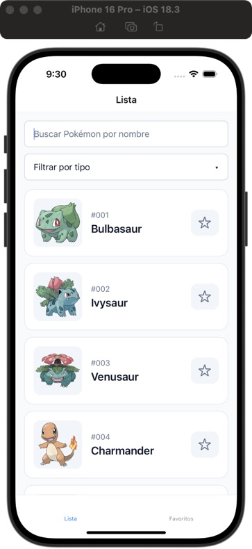
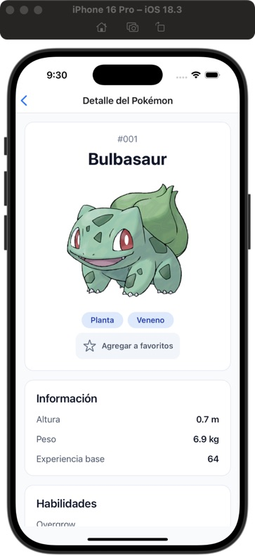
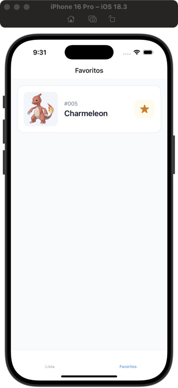

# Pokédex · Challenge decampoacampo

Aplicación móvil desarrollada con React Native y Expo SDK 54. Permite explorar Pokémon, consultar sus características, buscar por nombre, filtrar por tipo y administrar favoritos que se guardan en el dispositivo.

Los datos se obtienen de [PokeAPI](https://pokeapi.co/) mediante Axios.

## Capturas de la aplicación

Capturas reales tomadas en el simulador de iPhone 16 Pro con iOS 18.3.

|                                                    Listado                                                     |                                                      Detalle                                                      |                                              Favoritos                                               |
| :------------------------------------------------------------------------------------------------------------: | :---------------------------------------------------------------------------------------------------------------: | :--------------------------------------------------------------------------------------------------: |
|  |  |  |

## Instalación

```bash
git clone https://github.com/lucasbonacci/pokedex-decampoacampo.git
cd pokedex-decampoacampo
npm ci
```

No se requieren claves de API ni archivos `.env`.

## Ejecutar la aplicación

Iniciar el servidor de desarrollo:

```bash
npm start
```

Desde la terminal de Expo, presionar `a` para abrir Android o `i` para abrir el simulador de iOS. También se puede escanear el QR con un dispositivo que tenga Expo Go compatible; el dispositivo y la computadora deben poder comunicarse por la red local.

### Compatibilidad con Expo Go

Las versiones actuales de Expo Go publicadas en Play Store y App Store no son compatibles con Expo SDK 54.

## Tests y verificación de tipos

Ejecutar todas las pruebas:

```bash
npm test
```

Ejecutar pruebas en modo watch durante el desarrollo:

```bash
npm run test:watch
```

Verificar TypeScript sin generar archivos:

```bash
npx tsc --noEmit
```

Las pruebas usan Jest, `jest-expo` y React Native Testing Library. Cubren búsqueda por nombre, combinación con filtros por tipo, paginación, eliminación de duplicados, alta y baja de favoritos, recuperación ante errores de guardado y restauración de la lista persistida. La API y AsyncStorage se simulan en los tests.

Si Watchman genera un error de permisos en el entorno local:

```bash
npm test -- --watchman=false
```

## Funcionalidades

- Listado con `FlatList`, filas memoizadas y carga de páginas de 20 Pokémon mediante infinite scroll.
- Imágenes con placeholder, transición y caché en memoria y disco mediante `expo-image`.
- Detalle con imagen, tipos, habilidades, estadísticas base, altura, peso y experiencia.
- Búsqueda por nombre con debounce de 500 ms, sin distinguir mayúsculas, y filtro adicional por tipo.
- Agregar y quitar favoritos desde el listado o el detalle.
- Sección de favoritos persistidos localmente.
- Restauración de las páginas cargadas del listado al volver a abrir la app.
- Indicadores de carga, estados vacíos, mensajes de error y botones de reintento.

## Persistencia y uso offline

Los favoritos se guardan en AsyncStorage mediante Zustand. La lista y otras consultas se persisten con TanStack Query y AsyncStorage, con `maxAge` y `gcTime` configurados en `Infinity`: los datos no se eliminan por antigüedad.

La lista se considera desactualizada después de cinco minutos. Esto permite intentar actualizarla al volver a consultarla y conservar los datos anteriores si la solicitud falla.

Alcance del modo offline:

- La lista necesita haberse cargado al menos una vez y solo permite consultar las páginas guardadas.
- La búsqueda y los filtros dependen de que sus respectivos catálogos se hayan descargado previamente.
- Marcar un favorito desde el listado guarda sus datos básicos, pero no descarga automáticamente su detalle completo.
- Las imágenes dependen de la caché de `expo-image`; no se garantiza que todas estén disponibles sin conexión.
- Borrar los datos de la aplicación o desinstalarla elimina la persistencia local.

## Tecnologías y organización

Expo SDK 54 · React Native 0.81 · React 19 · TypeScript · React Navigation 6 · Axios · TanStack Query · Zustand · AsyncStorage · Expo Image.

```text
src/
├── api/          # Cliente Axios y acceso a PokeAPI
├── cache/        # Configuración y persistencia de TanStack Query
├── components/   # Componentes reutilizables y estados de UI
├── constants/    # Paginación, caché y etiquetas
├── helpers/      # Conversión de datos y manejo de errores
├── hooks/        # Consultas, favoritos y debounce
├── navigation/   # Stack, tabs y tipos de navegación
├── screens/      # Listado, detalle y favoritos
├── stores/       # Estado persistido de favoritos
└── types/        # Tipos de la API y del listado
```

## Consideración de compatibilidad

El proyecto conserva React Navigation 6, recomendado en el challenge. Sin embargo, `@react-navigation/native-stack` v6 junto con `react-native-screens` v4.16 no es una combinación oficialmente soportada: [Screens v4 declara soporte para Native Stack v7](https://github.com/software-mansion/react-native-screens/blob/4.16.0/README.md#usage-with-react-navigation). La navegación mostrada en las capturas funciona en el simulador utilizado, pero esa comprobación no sustituye la validación en ambas plataformas. La actualización coordinada a React Navigation 7 queda como mejora pendiente.
